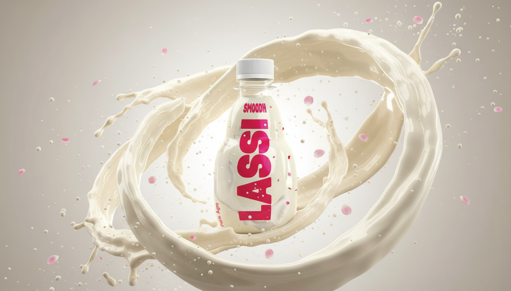

# Smoodh — Premium Flavored Milkshake Experience

A cinematic, Awwwards-level product showcase built with **Next.js 14**, **Framer Motion**, and **Tailwind CSS**.



## ✨ Features

- **120-frame canvas scroll animation** with physics-based spring motion
- **3-layer parallax particle system** with optical depth-of-field blur
- **Cinematic crossfade transitions** between 3 product flavors
- **Extreme glassmorphism navbar** with scroll-triggered border glow
- **Awwwards-level micro-interactions**: 3D hover, magnetic CTA, shimmer beams
- **Noise texture overlay** for a photographic, tactile feel
- Static export — deploys to **Netlify / Vercel** with zero config

## 🧰 Tech Stack

| Layer | Technology |
|-------|------------|
| Framework | Next.js 14 (App Router) |
| Language | TypeScript |
| Animation | Framer Motion v12 |
| Styling | Tailwind CSS v3 |
| Font | Outfit (Google Fonts) |
| Deployment | Netlify Edge (static export) |

## 🚀 Getting Started

### Prerequisites
- Node.js 18+
- npm or yarn

### Install dependencies
```bash
npm install
```

### Run the development server
```bash
npm run dev
```
Open [http://localhost:3000](http://localhost:3000)

### Build for production
```bash
npm run build
```
The optimized static output is generated in the `out/` directory.

## 📁 Project Structure

```
smoodh/
├── app/                    # Next.js App Router
│   ├── layout.tsx          # Root layout (Navbar, Noise overlay, fonts)
│   ├── page.tsx            # Home page — product switcher orchestration
│   └── globals.css         # Global styles and shimmer keyframe
│
├── components/             # UI components
│   ├── ArrowButton.tsx     # Left/right navigation arrows
│   ├── BuyNowSection.tsx   # Pricing card with magnetic CTA
│   ├── FloatingParticles.tsx # 3-layer parallax particle system
│   ├── Footer.tsx          # Site footer
│   ├── Navbar.tsx          # Glassmorphism fixed navbar
│   ├── NoiseOverlay.tsx    # SVG noise texture overlay
│   ├── ProductBottleScroll.tsx # Canvas 120-frame scroll engine
│   ├── ProductDetails.tsx  # Two-column product info section
│   └── ProductTextOverlays.tsx # Scroll-triggered cinematic copy
│
├── data/
│   └── products.ts         # All flavor data (details, pricing, glows)
│
├── lib/
│   └── easing.ts           # Shared Framer Motion easing constants
│
└── public/
    ├── images/             # Frame sequence images (.webp)
    ├── lassi.png
    ├── chocolate.png
    └── hazelnut.png
```

## 🌐 Deploy to Netlify

```bash
# Install Netlify CLI
npm install -g netlify-cli

# Build and deploy to production
npm run build
netlify deploy --prod --dir=out
```

Or connect the GitHub repository to Netlify and set:
- **Build command**: `npm run build`
- **Publish directory**: `out`

## 📄 License

MIT © Smoodh
